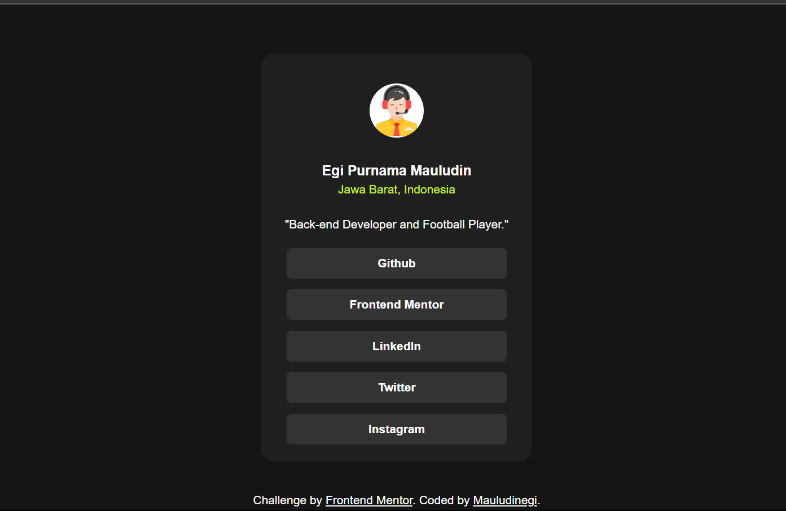

# Frontend Mentor - Social links profile solution

This is a solution to the [Social links profile challenge on Frontend Mentor](https://www.frontendmentor.io/challenges/social-links-profile-UG32l9m6dQ). Frontend Mentor challenges help you improve your coding skills by building realistic projects. 

## Table of contents

- [Overview](#overview)
  - [The challenge](#the-challenge)
  - [Screenshot](#screenshot)
  - [Links](#links)
- [My process](#my-process)
  - [Built with](#built-with)
  - [What I learned](#what-i-learned)
  - [Continued development](#continued-development)
  - [Useful resources](#useful-resources)
- [Author](#author)
- [Acknowledgments](#acknowledgments)


## Overview

### The challenge

Users should be able to:

- See hover and focus states for all interactive elements on the page

### Screenshot



### Links

- Solution URL: [Add solution URL here](https://your-solution-url.com)
- Live Site URL: [https://mauludinegi.github.io/social-links/]

## My process

### Built with

- Semantic HTML5 markup
- CSS custom properties
- Flexbox
- CSS hover


### What I learned

In this challenge, I've learned about semantic HTML and CSS. Semantic Element HTML 5 is really a big deal because it represents a significant advancement. And It not only aids screen reader technology but also contributes to SEO.

Semantic HTML refers to the use of HTML tags that carry meaning about the structure and content of the web page, rather than merely dictating its appearance. These tags provide context to browsers and developers, making it easier to understand the purpose of different sections and elements on a page.

Semantic HTML helps improve accessibility for assistive technologies, such as screen readers, by providing more meaningful information about the content. Moreover, it contributes positively to search engine optimization (SEO), as search engines can better interpret the content and context of the page.

Examples of semantic HTML tags include `<header>, <nav>, <main>, <article>, <section>, <aside>, <footer>`, and more. By using these tags appropriately, developers can create well-structured and meaningful web pages that are both accessible and SEO-friendly.

Also, the CSS concepts I acquired knowledge of include techniques such as using hover effects to change the background color when the mouse hovers over a card or text, adding an interactive and dynamic touch. Additionally, I explored various CSS properties like display and media screen properties, enhancing my ability to control the layout and appearance of elements on different screen sizes.


These are code snippets semantic html and css that i learned, see below:

```html
<body>
  <main>
    <div></div>
  </main>
  <footer>
    <p></p>
  </footer>
</body>
```
```css
*,
*:before,
*:after {
  margin: 0;
  padding: 0;
  box-sizing: border-box;
}

:root {

}

.card:hover {
  box-shadow: 0 8px 16px 0 rgba(62, 61, 61, 0.2);
}
```


### Continued development

In my next challenge, I am wholeheartedly dedicated to advancing my skills and mastering the art of crafting forms through CSS. I am determined to delve into the intricacies of this essential web development language, pushing my boundaries to achieve a profound understanding and proficiency.

My objective is clear: to transform my ability to create aesthetically pleasing and functional forms that seamlessly integrate into web applications. CSS, with its vast capabilities, serves as the key to unlocking responsive and visually captivating user interfaces.

Wish me luck!


### Useful resources

- [1. w3school](https://www.w3schools.com/) - This helped me when I forgot something about the code. I just searched, and it appeared and provided the information I needed.
- [2. medium](https://www.medium.com) - This is a place of articles for learning espescially web development.


## Author

- Website - [mauludinegi](https://www.linkedin.com/in/mauludinegi)
- Frontend Mentor - [@mauludinegi](https://www.frontendmentor.io/profile/Mauludinegi)


## Acknowledgments

I'd like to thank everyone who has supported me. I hope that support will not break and will continue in the future. Also, thank you for the YouTube channel and website that provide knowledge, so I can learn from them. The list of YouTube channels that I learned from: WPU, Programmer Zaman Now, and FreeCodeCamp.


